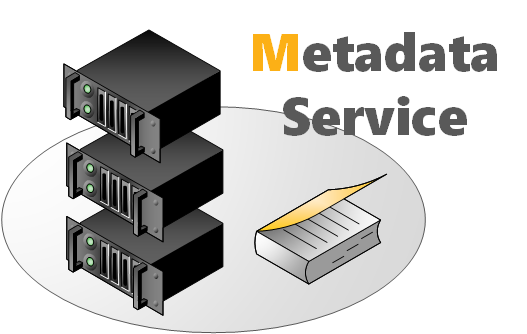
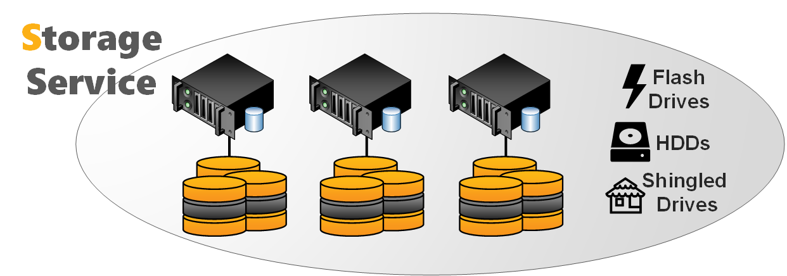
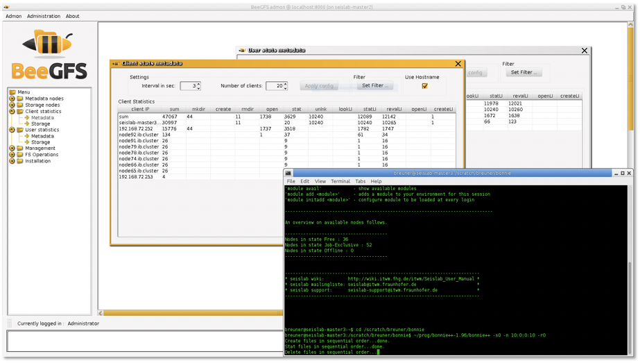

====================
General Architecture
====================

The BeeGFS architecture is composed of four main services:

Management service
  A registry and watchdog for all other services
Storage service
  Stores the distributed user file contents
Metadata service
  Stores access permissions and striping information
Client service
  Mounts the file system to access the stored data

In addition to the main services list above, BeeGFS also comes with an
optional graphical administration and monitoring service (the
so-called “admon”).

.. figure:: architecture.jpeg

   BeeGFS Architecture Overview

All BeeGFS services write a log file with the corresponding service
name to /var/log/beegfs-*.log

For high flexibility, it is possible to run multiple instances with
any BeeGFS service on the same machine. These instances can be part of
the same BeeGFS file system instance or as well of different file
system instances. One typical example is the client service, that can
mount two different BeeGFS file systems (e.g. an old one and a new
one) on the same compute node.

High flexibility and easy administration is also given since the
BeeGFS management, meta, and storage services do not access the disks
directly. Instead, they store data inside any local Linux POSIX file
system, such as ext4, xfs or zfs. This provides the flexibility to
choose the underlying file system which works best for the given
service, use case or hardware and makes it also easy to explore how
BeeGFS stores files.

The underlying file system in which the BeeGFS services store their
data are called management, metadata, or storage targets. These
correspond to the name of the BeeGFS service, that uses the target to
store its data. While the BeeGFS management and metadata service each
use a single target per service instance, the storage service supports
one or multiple storage targets for a single storage service instance.

This software-based approach without any strict requirements for the
hardware provides the possibility to choose from a very wide range of
hardware components. In the following chapters, we will discuss the
BeeGFS services and flexibility in more detail.

The Management Service
======================

   Management Service

The management service can be figured as a “meeting point” for the
BeeGFS metadata, storage, and client services. It is very light-weight
and typically not running on a dedicated machine, as it is not
critical for performance and stores no user data. It is watching all
registered services and checks their state. Therefore, it is the first
service, which needs to be setup in a newly deployed environment.

The management service maintains a list of all other BeeGFS services
and their state.

The Metadata Service
====================

   Metadata Service

The metadata service stores information about the data e.g. directory
information, file and directory ownership and the location of user
file contents on storage targets. It provides information about the
location (the so-called “stripe pattern”) for an individual user file
to a client when the client opens the file, but afterwards the
metadata service is not involved in data access (i.e. for file read
and write operations) until the file is closed.

The BeeGFS metadata service is a scale-out service, meaning there can
be one or many metadata services in a BeeGFS file system. Each
metadata service is responsible for its exclusive fraction of the
global namespace, so that having more metadata servers improves the
overall system performance. Adding more metadata servers later is
always possible.

Each metadata service instance has exactly one metadata target to
store its data. On the metadata target, BeeGFS creates one metadata
file per user-created file. This is an important design decision of
BeeGFS to avoid the case of storing all metadata inside a single
database that could possibly get corrupted.

Usually, a metadata target is an ext4 file system based on a RAID1 or
RAID10 of flash drives, as low metadata access latency improves the
responsiveness of the file system. BeeGFS metadata is very small and
grows linear with the number of user-created files. 512GB of usable
metadata capacity are typically good for about 150 million user files.

As low metadata access latency is a major benefit for performance of
the overall system, faster CPU cores will improve latency.

The Storage Service
===================

   Storage Service

The storage service (sometimes also referred to as the “object storage
service”) is the main service to store striped user file contents,
also known as data chunk files.

Similar to the metadata service, the BeeGFS storage service is based
on a scale- out design. That means, you can have one or multiple
storage services per BeeGFS file system instance, so that each storage
service adds more capacity and especially also more performance to the
file system.

A storage service instance has one or multiple storage targets. While
such a storage target can generally be any directory on a local
filesystem, a storage target typically is a hardware RAID-6 (typically
composed of 8+2 or 10+2) or zfs RAIDz2 volume, of either internal or
externally attached drives.

The storage service works with any local Linux POSIX file
system. Usually, the storage targets are based on xfs in the case of
hardware RAID controllers.

In contrast to the metadata service, many people try to optimize the
traffic on the storage targets for large sequential access to have
optimal performance on spinning disks. However, as BeeGFS uses all the
available RAM on the storage servers (which is not otherwise allocated
by processes) automatically for caching, it can also aggregate small
IOs requests into larger blocks before writing the data out to
disk. Furthermore it is able to serve data from the cache if it has
already been recently requested by another client.

The capability to quickly write bursts of data into the server RAM
cache or to quickly read data from it is also the reason why it makes
sense to have a network that is significantly faster than the disk
streaming throughput of the servers.

To distribute the used space and to aggregate the performance of
multiple servers even for a single large file, BeeGFS uses striping,
which means the file gets split up into chunks of fixed size and those
chunks are distributed across multiple storage targets.

The chunksize and number of targets per file is decided by the
responsible metadata service when a file gets created. This
information is called the stripe pattern. The stripe pattern can be
configured per directory (e.g. by using the beegfs-ctl command line
tool) or even for individual files (e.g. by using the BeeGFS Striping
API).

The files on the storage targets containing the user data are called
chunk files. For each user file, there is exactly one chunk file on
the corresponding storage targets. To not waste space, BeeGFS only
creates chunk files when the client actually writes data to the
corresponding target. And also, for not wasting space, the chunk size
is not statically allocated, meaning when the user writes only a
single byte into the file, BeeGFS will also create only a single chunk
file of 1 byte in size.

By default, BeeGFS picks the storage targets for a file randomly, as
this has shown to provide best results in multi-user environments
where (from the point of view of the file system) the different users
are also concurrently creating a random mix of large and small
files. If necessary, (e.g. to have deterministic streaming benchmark
results) different target choosers are available in the metadata
service configuration file.

To prevent storage targets running out of free space, BeeGFS has three
different labels for free target capacity: normal, low and emergency
(the latter meaning only very little space left or the target is
unreachable). The target chooser running on the metadata service will
prefer targets labeled as normal. As long as such targets are
available, and it will not pick any target labeled as critical before
all targets entered that state. With this approach, BeeGFS can also
work with storage targets of different sizes. The thresholds for low
and emergency can be changed in the management service configuration
file.

The Client Service
==================

BeeGFS comes with a client that registers natively with the virtual
file system interface of the Linux kernel for maximum
performance. This kernel module has to be compiled to match the used
kernel, but don’t worry: The kernel module source code is included in
the normal client package and compilation for the currently running
Linux kernel happens fully automatically, so there are no manual steps
required when you update your Linux kernel or when you update the
BeeGFS client service. The installation or a BeeGFS client update can
even be done without rebooting the machine.

The client kernel module uses an additional userspace helper daemon
for DNS lookups and to write the log file.

When the client is loaded, it will mount the file systems defined in
beegfs- mounts.conf instead of the usual Linux approach based on
/etc/fstab (which is also possible with BeeGFS, but not
recommended). This is an approach of starting the beegfs-client like
any other Linux service through a service start script. It enables the
automatic recompilation of the BeeGFS client module after system
updates and makes handling of the BeeGFS client service generally more
convenient.

The native BeeGFS client should be used on all hosts that are supposed
to access BeeGFS with maximum performance. However, it is also
possible to re-export a BeeGFS mountpoint through NFSv4 or through
Samba or to use BeeGFS as a drop- in replacement for Hadoop’s
HDFS. Upcoming releases of BeeGFS will also provide a native BeeGFS
client for Windows.

Admon: Administration and Monitoring System
===========================================

   Admon GUI - Client Operation Statistics

In addition to the beegfs-ctl command line tool, the optional BeeGFS
Administration and Monitoring system (short: admon) provides a
graphical interface to perform basic administrative tasks and to
monitor the state of the file system and its components.

The BeeGFS admon consists of two parts:

- The admon backend service, which runs on any machine with network
  access to the metadata and storage services. This service gathers
  the status information of the other BeeGFS services and stores it in
  a database.

- The graphical Java-based client, which runs on your workstation. It
  connects to the remote admon daemon via http.
