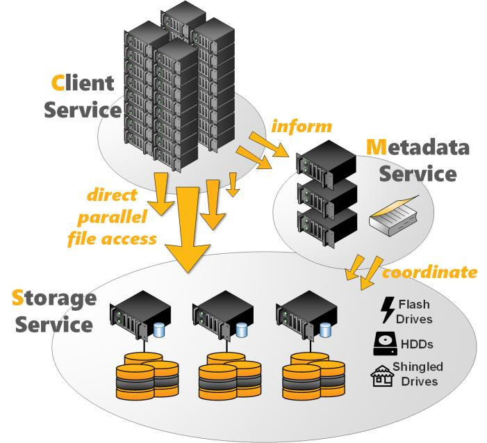

====================
General Architecture
====================

The BeeGFS architecture is composed of four main services:

Management service
  A registry and watchdog for all other services
Storage service
  Stores the distributed user file contents
Metadata service
  Stores access permissions and striping information
Client service
  Mounts the file system to access the stored data

In addition to the main services list above, BeeGFS also comes with an
optional graphical administration and monitoring service (the
so-called “admon”).

   Figure 1: BeeGFS Architecture Overview

All BeeGFS services write a log file with the corresponding service
name to /var/log/beegfs-*.log

For high flexibility, it is possible to run multiple instances with
any BeeGFS service on the same machine. These instances can be part of
the same BeeGFS file system instance or as well of different file
system instances. One typical example is the client service, that can
mount two different BeeGFS file systems (e.g. an old one and a new
one) on the same compute node.

High flexibility and easy administration is also given since the
BeeGFS management, meta, and storage services do not access the disks
directly. Instead, they store data inside any local Linux POSIX file
system, such as ext4, xfs or zfs. This provides the flexibility to
choose the underlying file system which works best for the given
service, use case or hardware and makes it also easy to explore how
BeeGFS stores files.

The underlying file system in which the BeeGFS services store their
data are called management, metadata, or storage targets. These
correspond to the name of the BeeGFS service, that uses the target to
store its data. While the BeeGFS management and metadata service each
use a single target per service instance, the storage service supports
one or multiple storage targets for a single storage service instance.

This software-based approach without any strict requirements for the
hardware provides the possibility to choose from a very wide range of
hardware components. In the following chapters, we will discuss the
BeeGFS services and flexibility in more detail.
